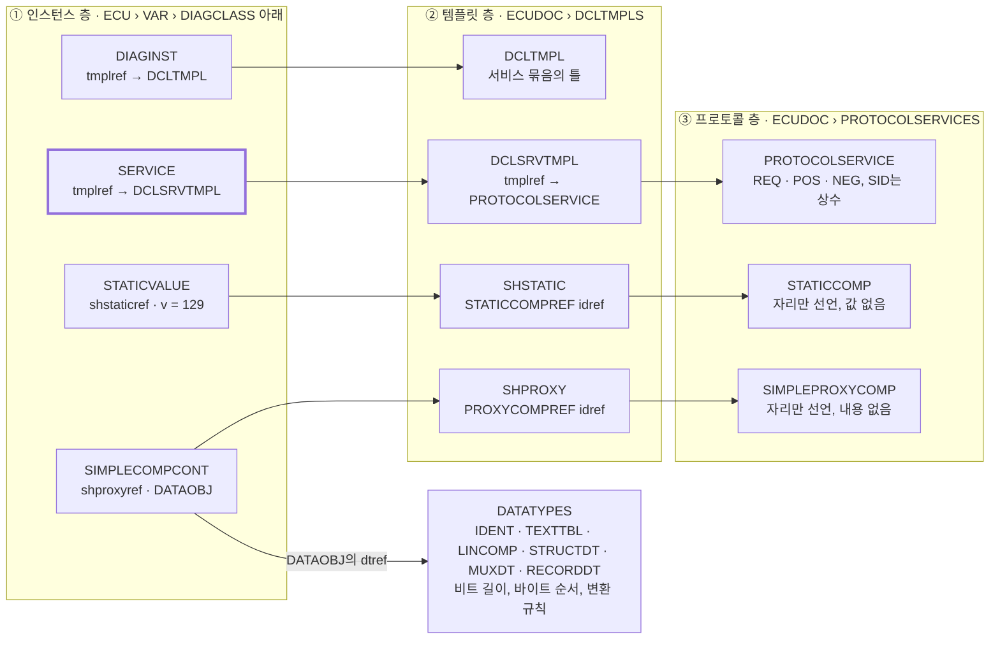
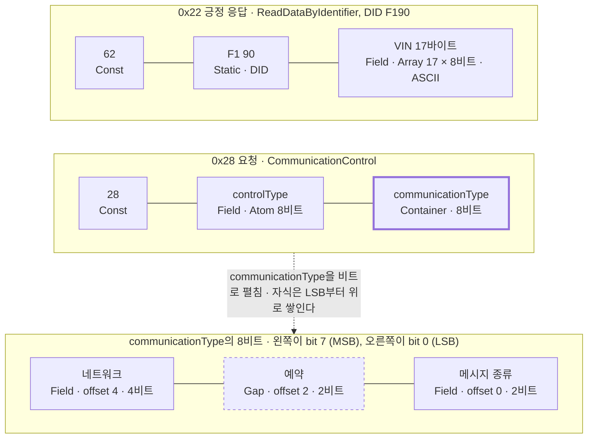
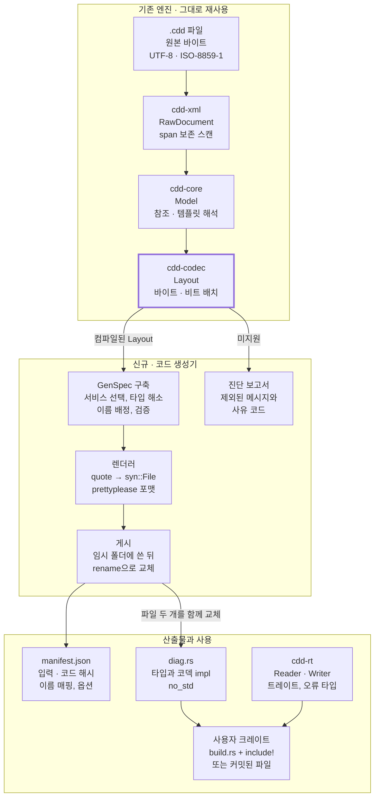
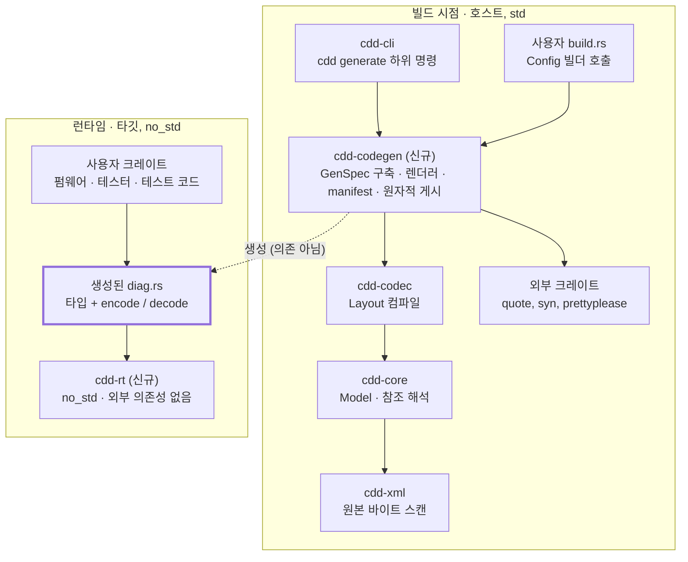
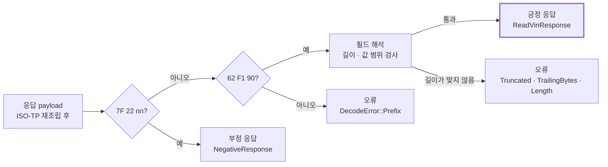
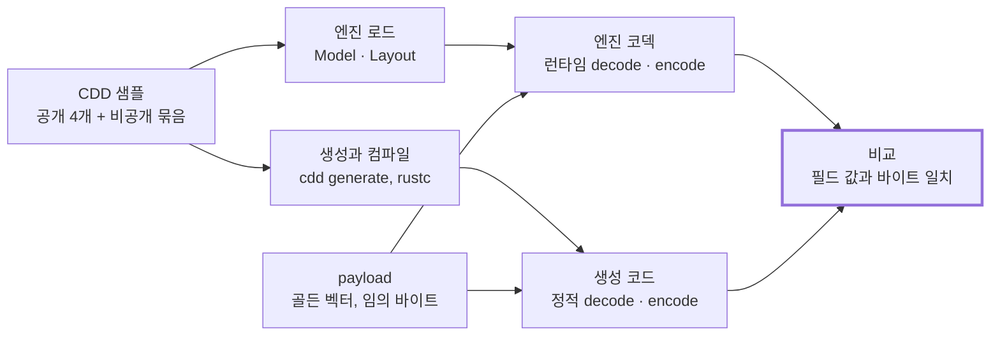
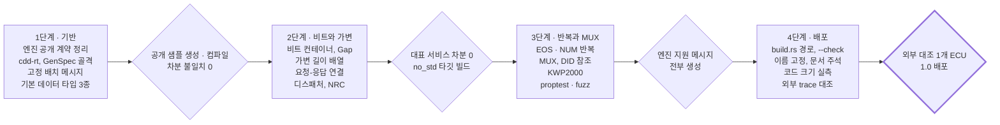

# CDD → Rust 코드 생성 검토

2026-10-09 · 김동규

## 1. 요약과 결론

CDD에서 Rust 코드를 생성하는 것은 타당하다. 새 파서를 만들지 말고 `cdd-rust-engine`이 계산한 `Layout`을 입력으로 삼는 생성기를 `dbc_codegen`의 패턴으로 만드는 것을 권장한다. 어려운 부분인 CDD 해석은 엔진이 이미 구현했고, 남은 가장 큰 문제는 그 해석이 외부 도구와 대조된 적이 없다는 점이다.

| 질문 | 판단 | 자세한 내용 |
| --- | --- | --- |
| 만들 가치가 있는가 | 있다. 필드 오류가 컴파일 시점에 잡히고, `no_std` 타깃에 CDD 파일 없이 올릴 수 있다 | 2장 |
| 이미 있는 도구인가 | 아니다. 공개된 CDD 도구는 모두 런타임 해석기다 | 5장 |
| 무엇을 재사용하나 | 앞단은 엔진의 세 크레이트(9,622줄), 뒷단은 `dbc_codegen`의 설정 · manifest · 게시 · 스냅샷 패턴 | 3장, 4장 |
| 무엇을 새로 만드나 | `cdd-codegen`(중간 표현 `GenSpec`과 렌더러), `cdd-rt`(`no_std` 런타임) | 7장, 8장 |
| 어떤 방식으로 생성하나 | CLI로 생성해 커밋하는 것이 기본, `build.rs`도 지원. `quote` + `prettyplease`. derive 매크로 없이 직접 쓴 코덱 | 10장 |
| 실제로 되는가 | 생성 결과의 모형을 손으로 써서 Rust 1.88.0과 1.98.1에서 컴파일했고 테스트 6개가 통과했다 | 9장 |
| 어디까지 생성되나 | 엔진이 레이아웃을 컴파일하는 메시지. 샘플 25개 파일 기준 요청 928개, 긍정 응답 927개이고 차단된 97개는 제외 | 3장, 11장 |
| 가장 큰 리스크는 | 해석 규칙이 Experimental이다. 외부 trace 대조를 1.0의 조건으로 둔다 | 12장, 13장 |

구조에 관한 내용(크레이트 구성, 파이프라인, 방식 선택)은 3 · 4 · 7 · 10장에, 기술에 관한 내용(CDD 구조, 타입 매핑, 생성 코드, 검증)은 6 · 8 · 9 · 11장에 있다. 다이어그램은 일곱 개다.

## 2. 배경: CDD와 UDS, 그리고 코드 생성이 필요한 이유

CDD는 ECU 하나의 진단 사양을 담은 Vector의 XML 문서이고, 그 안의 서비스 · 데이터 타입 정의만으로 UDS payload의 바이트 배치가 결정된다. 지금은 이 정보를 런타임 엔진이 매번 해석한다. 같은 정보를 빌드 시점에 Rust 타입으로 굳히는 것이 이 검토의 대상이다.

### 2.1 용어

| 용어 | 내용 |
| --- | --- |
| CDD (`*.cdd`) | [CANdelaStudio](https://www.vector.com/int/en/products/products-a-z/software/candelastudio/)가 만드는 CANdela 문서. ECU마다 템플릿에서 생성한다. 루트 요소는 `CANDELA`, DOCTYPE은 `candela.dtd` |
| CDDT (`*.cddt`) | OEM이 요구하는 서비스와 필수 내용을 정한 템플릿. 루트와 파싱 규칙은 CDD와 같다 |
| ODX | ASAM MCD-2 D / ISO 22901 진단 데이터 교환 형식. CANdelaStudio는 ODX 2.0.1 · 2.1 · 2.2로 내보낼 수 있다 |
| UDS | [ISO 14229](https://en.wikipedia.org/wiki/Unified_Diagnostic_Services). 긍정 응답 SID는 요청 SID + 0x40, 부정 응답은 `7F` + 요청 SID + NRC의 3바이트 |
| ISO-TP | [ISO 15765-2](https://en.wikipedia.org/wiki/ISO_15765-2). CAN 프레임을 재조립해 UDS payload를 만든다. 이 문서의 코덱은 재조립 이후의 payload만 다룬다 |
| DID | 데이터 식별자(2바이트). `0x22` 읽기, `0x2E` 쓰기의 대상 |
| NRC | 부정 응답 코드(1바이트) |

### 2.2 런타임 해석과 코드 생성의 차이

| 관점 | 런타임 해석 (현재 엔진) | 코드 생성 (검토 대상) |
| --- | --- | --- |
| CDD 파일 | 실행할 때마다 필요 | 빌드할 때만 필요 |
| 오류가 드러나는 시점 | 실행 중. 필드를 문자열 키로 지정 | 컴파일 시. 필드가 구조체 멤버 |
| 실행 환경 | `std`, 힙, 선택적으로 SQLite | `no_std`, 힙 없이 가능 |
| 드는 비용 | 로드 · 해석 시간과 메모리 | 바이너리 크기와 빌드 시간 |
| CDD가 바뀌면 | 새 파일을 열면 끝 | 재생성하고 다시 빌드 |
| 기밀 | CDD 파일을 함께 배포 | 구조만 바이너리에 남고 설명 텍스트는 뺄 수 있음 |
| 맞는 용도 | 진단 도구, 로그 분석, CDD 편집기 | ECU 펌웨어, 임베디드 테스터, 타입이 검사되는 테스트 코드 |

두 방식은 경쟁 관계가 아니다. 엔진이 생성기의 앞단이 되고, 엔진의 디코드 결과가 생성된 코드의 정답지가 된다.

### 2.3 생성된 코드를 쓰는 쪽

- **테스터(클라이언트).** 요청을 만들고 응답을 해석한다. `ReadVin::request()`로 `22 F1 90`을 얻고, 응답 바이트를 `ReadVinResponse`로 바꾼다.
- **ECU(서버).** 받은 요청을 해석하고 응답을 만든다. 같은 타입을 반대 방향으로 쓴다.
- **시뮬레이션과 테스트.** 양쪽을 모두 쓴다. `dbc_codegen`의 노드 시뮬레이션과 같은 자리다.

생성 코드는 방향에 중립적인 코덱이어야 하며, 통신 실행(타이밍, 재시도, 세션 유지)은 포함하지 않는다.

## 3. 참고 저장소 분석 ① cdd-rust-engine

`cdd-rust-engine`은 CDD를 런타임에 해석하는 엔진이고, 코드 생성기에 필요한 앞단(파서 · 의미 모델 · 레이아웃 계산)을 이미 구현해 두었다. 생성기는 XML을 다시 파싱할 필요 없이 `cdd_codec::layout::compile_layout`이 돌려주는 `Layout`을 입력으로 삼으면 된다.

분석 기준은 커밋 `e6b1409`(ABI revision 3), 워크스페이스 버전 0.0.1, Rust 1.98.1 · edition 2021이다.

### 3.1 크레이트 구성

| 크레이트 | 책임 | src 줄 수 | tests 줄 수 | 코드 생성에서의 쓰임 |
| --- | --- | --- | --- | --- |
| `cdd-xml` | 원본 바이트 보존 스캐너, span, ByteEdit, 서식 추론 | 1,859 | 2,541 | 입력 로드. 편집 기능은 불필요 |
| `cdd-core` | Registry, DataType, 템플릿 해석, DID, STATE, 속성, ExternalKey | 4,554 | 3,991 | 핵심 입력. `Model`과 이름 키 |
| `cdd-codec` | Layout 컴파일, 비트 배치, encode/decode, matcher, NRC | 3,209 | 4,788 | 핵심 입력. `Layout`과 테스트 오라클 |
| `cdd-store` | SQLite 투영, 편집 Journal, 세션 잠금 | 3,173 | 3,700 | 불필요 |
| `cdd-api` | Engine · Session · Workspace 파사드, JSON 계약 | 4,470 | 8,121 | `CddEngine::open`만 사용 |
| `cdd-ffi` | C ABI v3 (`cdd.h`) | 961 | 2,605 | 불필요 |
| `apps/cdd-cli` | `stats` `inspect` `validate` `encode` `decode` `identify` `conditions` `index` `search` `edit` 등 | 1,728 | 1,703 | `generate` 하위 명령을 추가할 자리 |

합계는 구현 19,954줄, 테스트 27,449줄이다. 외부 의존성은 `sha2`, `thiserror`, `rusqlite`, `serde_json`, `unicode-general-category` 정도로 적다. XML 파서도 자체 구현이며 `quick-xml`은 대조 테스트에만 쓴다.

의존 방향은 한쪽으로만 흐른다.

```text
cdd-core  → cdd-xml
cdd-codec → cdd-core
cdd-store → cdd-core
cdd-api   → cdd-codec, cdd-store, cdd-core, cdd-xml
cdd-ffi, cdd-cli → cdd-api
```

### 3.2 생성기가 그대로 쓸 수 있는 것

- **의미 모델 `cdd_core::model::Model`.** `Ecu → Variant → DiagClass → DiagInstance → Service` 계층과 서비스별 `request` · `positive` · `negative` 메시지를 갖는다. 메시지는 `Component` 열이다(`Const`, `Static`, `Proxy`, `Mux`, `Iter`, `Unsupported`).
- **레이아웃 IR `cdd_codec::layout::Layout`.** 메시지 하나를 바이트 위치가 확정된 `LayoutItem` 열로 바꾼 결과다. 인코딩 · 디코딩 · 매처가 모두 이 하나를 읽으므로 상수 위치가 서로 어긋나지 않는다.
- **외부 안정 키 `ExternalKey`.** `<ECU>/<VAR>[/<DIAGCLASS>]/<DIAGINST>/<SERVICE>` 형태이고, 이름이 겹치면 문서 순서대로 `~2`, `~3`을 붙인다. 샘플의 서비스 1,821개에서 중복 키가 0건이다. Rust 식별자를 만드는 출발점으로 적합하다.
- **검증 코드.** `CDD-BIT-001`, `CDD-ATTR-001` 같은 코드가 미지원 사유를 구분한다. 생성 단계의 진단 메시지로 그대로 쓸 수 있다.
- **골든 벡터.** `tools/reference/golden/`에 요청 251 KB, 응답 3.2 MB 분량의 기대 결과가 있다. 생성된 코드의 차분 테스트 기준이 된다.

`LayoutItem`의 여덟 가지 변형이 곧 생성기가 다뤄야 할 경우의 전부다.

| `LayoutItem` | CDD 원천 | 의미 |
| --- | --- | --- |
| `Const(u8)` | `CONSTCOMP` | SID 같은 고정 1바이트 |
| `Static(StaticItem)` | `STATICCOMP` | 서브펑션 · DID 번호 같은 고정 값 |
| `Field(FieldPlan)` | `SIMPLEPROXYCOMP` + `DATAOBJ` | 입력 · 출력 필드. `Atom` / `Array` / `ToEnd` |
| `Container(ContainerLayout)` | `STRUCT` | 8\~64비트 정수 안의 비트 필드 묶음 |
| `Nrc(NrcItem)` | `SPECDATAOBJ` + `NEGRESCODEPROXIES` | 부정 응답 코드 자리 |
| `Repeat(RepeatLayout)` | `EOSITERCOMP`, `NUMITERCOMP` | 고정 크기 요소의 반복 |
| `Gap(u32)` | `GAPDATAOBJ` | 예약 바이트 |
| `Mux(MuxLayout)` | `MUXCOMP` + `MUXDT` | 앞선 필드 값으로 고르는 분기 |

### 3.3 현재 한계

- **검증 수준이 Experimental이다.** 모든 일치는 같은 저자의 파이썬 기준 구현과의 내부 일관성이며, CANoe · CANdelaStudio 결과나 실제 trace와의 대조는 아직 없다.
- **인코딩이 디코딩보다 좁다.** 반복 · MUX · 가변 길이(`ToEnd`) 필드가 있는 요청과 BCD · float 값은 인코딩하지 못한다.
- **코덱이 없는 영역이 남아 있다.** `0x19` 스냅샷 · 확장 데이터 레코드, `0x22` 다중 DID, 가변 크기 반복 요소, 4,096바이트를 넘는 배열이 그렇다.
- **`Layout`이 생성기 입력으로는 덜 풀려 있다.** 데이터 타입이 `Model` 안의 `usize` 색인이고 필드가 문자열 키다. TEXTTBL 항목과 선형 변환 계수를 함께 풀어낸 별도 IR이 필요하다(8장).
- **저장소에 LICENSE와 README가 없다.** 생성기가 이 엔진에 의존하려면 라이선스부터 정해야 한다.

규모로 보면 고유 샘플 25개에서 컴파일되는 메시지는 요청 928개, 긍정 응답 927개이고, 남은 차단 메시지는 97개다.

## 4. 참고 저장소 분석 ② dbc\_codegen

`dbc_codegen`은 DBC에서 `no_std` Rust 코드를 만드는 생성기이고, CDD 생성기가 뒷단(검증 · 이름 배정 · 렌더링 · 게시 · 스냅샷 테스트)에서 따를 패턴을 거의 그대로 제공한다. 다만 렌더링이 문자열 `writeln!` 중심이어서, 중첩 구조가 많은 CDD에는 그대로 옮기기 어렵다.

분석 기준은 커밋 `4241ab3`, 버전 0.4.0, edition 2024, MSRV 1.88이다. [oxibus/dbc-codegen](https://github.com/oxibus/dbc-codegen)의 포크이며 라이선스는 MIT OR Apache-2.0이다.

### 4.1 처리 단계

1. **입력 디코딩** (`artifact.rs`): UTF-8 · Windows-1252 · CP949를 명시적으로 선택한다. 인코딩을 추정하거나 대체 문자로 바꾸지 않는다.
2. **파싱**: 외부 크레이트 `can-dbc` 10.0이 `Dbc` 구조체를 만든다.
3. **검증과 준비** (`preparation.rs`, 595줄): CAN ID, 비트 범위, 신호 겹침, factor/offset, mux 관계를 검사하고, 이름 충돌에 결정적인 접미사를 붙인다.
4. **렌더링** (`lib.rs`, 1,955줄): `render_message`, `render_signal` 같은 함수가 `writeln!`으로 소스 텍스트를 쓴다.
5. **정리**: 결과 문자열을 `syn::parse_file`로 파싱한 뒤 `prettyplease::unparse`로 포맷한다. 생성된 코드가 문법상 올바른지 이 단계에서 걸러진다.
6. **게시** (`artifact.rs`): `messages.rs`와 `manifest.json`을 임시 디렉터리에 쓴 뒤 rename으로 교체하고, 실패하면 이전 파일을 복원한다.

### 4.2 생성되는 코드의 모양

메시지 하나가 고정 크기 바이트 배열을 감싼 구조체가 되고, 신호마다 접근자가 붙는다.

```rust
#[derive(Clone, Copy)]
pub struct TemperatureData { raw: [u8; 8] }

impl TemperatureData {
    pub const MESSAGE_ID: embedded_can::Id = Id::Standard(StandardId::new(0x100).unwrap());
    pub const MESSAGE_SIZE: usize = 8;
    pub const AVERAGE_TEMPERATURE_MIN: f64 = -40_f64;

    pub fn average_temperature(&self) -> f64 {
        ((self.average_temperature_raw_val() as f64) * 0.1_f64 + -40_f64) as f64
    }
    pub fn average_temperature_raw_val(&self) -> u16 {
        self.raw.view_bits::<Lsb0>()[0..16].load_le::<u16>()
    }
    pub fn set_average_temperature(&mut self, value: f64) -> Result<(), CanError> { /* ... */ }
}
```

최상위에는 모든 메시지를 묶는 `Messages` 열거형과 `from_can_message(id, payload)` 디스패처가 있다. 생성 코드는 `bitvec`과 `embedded-can`에만 의존한다.

### 4.3 CDD 생성기가 가져올 패턴

| 패턴 | dbc\_codegen의 구현 | CDD 생성기에 적용 |
| --- | --- | --- |
| 빌더 설정 | `Config` + `typed-builder`, `#[non_exhaustive]` | 그대로 채택 |
| 기능별 켜고 끄기 | `FeatureConfig::{Always, Gated("feat"), Never}`가 `#[cfg(feature = ...)]`를 붙임 | `Debug`, `defmt`, `serde`, `arbitrary`에 그대로 채택 |
| 세 가지 사용 경로 | 라이브러리, `build.rs` + `include!`, CLI | 그대로 채택 |
| 이름 충돌 처리 | 모든 원본 정의에 이름을 배정한 뒤 필터링. 키워드는 `x` 접두사 | ExternalKey의 `~2` 규칙과 결합 |
| 재현성 manifest | 입력 SHA-256, 생성기 커밋 · 소스 해시, 옵션, 원본↔생성 이름 매핑, 코드 해시. 타임스탬프 없음 | 그대로 채택. CDD는 프로파일 버전과 검증 수준을 추가 |
| 원자적 게시 | 임시 디렉터리 + rename + 롤백 | 그대로 채택 |
| 스냅샷 테스트 | `insta` + `test_each_file`로 샘플마다 `.snap.rs` | 그대로 채택 |
| 생성물 컴파일 검사 | `trybuild`, 샘플 검증 예제가 88개 중 82개를 생성 · 컴파일하고 6개는 명시적으로 거부 | 그대로 채택 |
| 외부 도구 대조 | `candb.dll`과 payload 12개 비교 | CANoe · CANdelaStudio trace가 있을 때 적용 |
| 수치 정책 | `RoundingPolicy::{Truncate, NearestAway, Exact}`, i128 중간값, 실패 시 payload 보존 | 엔진의 `RoundingPolicy`와 통일 |

### 4.4 그대로 옮기면 안 되는 것

- **문자열 렌더링.** DBC 메시지는 평평한 신호 목록이지만 CDD는 컨테이너 · 반복 · MUX가 중첩된다. `writeln!`을 재귀적으로 이어 붙이면 들여쓰기와 괄호 짝을 사람이 관리해야 한다. 저장소의 주석도 향후 `syn`/`quote` 이전을 염두에 두고 있다.
- **고정 크기 `raw: [u8; N]`.** CAN 프레임은 최대 8 또는 64바이트로 고정이지만, UDS payload는 클래식 ISO-TP 기준 최대 4,095바이트(2016년판부터는 2³²−1바이트)이고 길이가 가변인 메시지가 있다.
- **ID 기반 디스패치.** DBC는 CAN ID 하나로 메시지가 정해지지만 UDS는 SID, 서브펑션, DID를 순서대로 봐야 하고 응답은 요청 문맥이 있어야 구분되는 경우가 있다.

참고로 이 저장소의 `dbc_samples/cantools/cdd/`에는 cantools에서 가져온 공개 CDD 샘플 4개(380 KB\~834 KB)가 들어 있어, 공개 저장소에 올릴 수 있는 테스트 입력으로 쓸 수 있다.

## 5. 오픈소스와 웹 자료 조사

CDD에서 Rust 코드를 생성하는 공개 도구는 찾지 못했다. 공개된 CDD 도구는 모두 런타임 해석기이고, 가장 가까운 선례는 DBC를 대상으로 하는 `dbc-codegen`과 cantools의 C 생성기다. 따라서 이 과제는 기존 도구의 포팅이 아니라, CDD 해석기와 DBC 생성기의 패턴을 결합하는 일이다.

### 5.1 진단 데이터 도구

| 프로젝트 | 언어 | 입력 | 방식 | 라이선스 | 이 과제에 주는 것 |
| --- | --- | --- | --- | --- | --- |
| [cdd\_utils](https://github.com/fshoocn/cdd_utils) | Python 3.10+ | CDD | 런타임. xsdata 파싱 후 5단계(레지스트리 → 변환 → 참조 해석 → 불변 DB) | 표기 없음 | 단계 구조와 지원 요소 목록. 코드 재사용은 불가 |
| [gocan](https://github.com/tomrford/gocan) | Go 1.25+ | DBC, CANdela | 런타임. ECU · Variant 선택, 서비스 카탈로그, 데이터 레코드 코덱 | MIT | 비트 배치 규칙의 비교 대상 |
| [DiagKit.VectorCdd](https://www.nuget.org/packages/DiagKit.VectorCdd) | C# (.NET 10) | CDD | 런타임 디코드 | Apache-2.0 | 타입 분류(`Linear`, `TextTable`, `Packet`, `BitsField`, `Multiplexer`, `Identity`) |
| [cantools](https://cantools.readthedocs.io/en/latest/) | Python | DBC, KCD, SYM, ARXML, CDD | 런타임(CDD는 DID 인코딩 · 디코딩). DBC는 C 소스 생성도 제공 | MIT | 공개 CDD 샘플, pack/unpack 생성 구조 |
| [odxtools](https://github.com/mercedes-benz/odxtools) | Python | ODX, PDX | 런타임. 코드 생성기의 기반으로 쓰는 것은 README가 “포부” 수준이라고 밝힘 | MIT | ODX 경로의 기준 구현 |
| [odx-converter](https://github.com/eclipse-opensovd/odx-converter) | Kotlin | PDX | 사전 변환. protobuf 컨테이너 안에 FlatBuffers 청크를 담은 MDD 파일 출력 | Apache-2.0 | 코드가 아닌 압축 DB라는 제3의 길 |
| [classic-diagnostic-adapter](https://github.com/eclipse-opensovd/classic-diagnostic-adapter) | Rust 1.88+ | MDD | 런타임. ECU당 MDD 하나를 읽어 SOVD 요청을 UDS로 번역 | Apache-2.0 | Rust 진단 스택의 실사례 |
| [dbc-codegen](https://github.com/oxibus/dbc-codegen) | Rust | DBC | 코드 생성 | MIT OR Apache-2.0 | 뒷단 패턴 전체(4장) |

세 가지 접근이 보인다.

1. **런타임 해석**: 원본 파일을 열어 매번 해석한다. CDD 도구 전부와 `cdd-rust-engine`이 여기에 속한다.
2. **사전 컴파일된 DB**: 원본을 작고 빠른 이진 형식으로 바꾸고 런타임이 그것을 읽는다. OpenSOVD의 MDD가 이 방식이다. 파일 크기와 접근 시간은 줄지만 타입 검사는 여전히 실행 중에 일어난다.
3. **코드 생성**: 구조를 타입으로 굳힌다. DBC 쪽에만 성숙한 사례가 있다.

### 5.2 Rust 구성 요소

| 크레이트 | 역할 | 판단 |
| --- | --- | --- |
| `quote` + `syn` | 토큰 단위로 Rust 코드를 조립 | 채택. 중첩 구조를 재귀적으로 합성하기 쉽다 |
| [`prettyplease`](https://github.com/dtolnay/prettyplease) | `syn::File`을 포맷된 소스로 출력. rustfmt와 달리 라이브러리로 쓰기 쉽고, 긴 생성 코드에서도 포맷을 포기하지 않는다 | 채택 |
| `heck`, `typed-builder` | 대소문자 변환, 설정 빌더 | 채택. `dbc_codegen`과 동일 |
| `insta`, `trybuild` | 스냅샷 테스트, 생성물 컴파일 검사 | 채택 |
| [`automotive_diag`](https://docs.rs/automotive_diag/latest/automotive_diag/) 0.1.29 | UDS · KWP2000 · OBD-II · DoIP의 `no_std` 열거형과 `ByteWrapper<T>` | 선택 기능. 생성 코드에서 `From` 변환만 제공 |
| [`deku`](https://docs.rs/deku/latest/deku/) 0.20 | derive 기반 비트 단위 읽기 · 쓰기. `alloc`만으로 `no_std` 지원, 내부에서 `bitvec` 사용 | 생성 코드의 타깃으로는 불채택 |
| `binrw` 0.15, `bilge` | derive 기반 바이트 파서, 비트필드 타입 | 불채택 |
| `bitvec` | `dbc_codegen`의 생성 코드가 쓰는 비트 슬라이스 | 불채택. shift와 mask를 직접 생성 |

`deku`나 `binrw`의 derive를 붙인 구조체를 생성하는 방안은 생성기가 단순해지는 장점이 있다. 그러나 선택자 마스크가 붙은 MUX, 앞선 필드로 세는 반복, 선형 변환과 범위 검사를 속성으로 표현하면 결국 사용자 정의 함수를 함께 생성해야 한다. 생성 코드가 의존성 없이 평범한 shift와 mask로 이루어지면 리뷰와 인증도 쉽다.

## 6. CDD 파일 구조 분석

CDD의 서비스 하나는 한 곳에 적혀 있지 않다. 메시지 골격은 프로토콜 층에, 슬롯 묶음은 템플릿 층에, 실제 값과 데이터는 인스턴스 층에 흩어져 있고 `id` 참조로 이어진다. 코드 생성에서 어려운 부분은 XML 읽기가 아니라 이 참조를 풀어 바이트 배치로 바꾸는 일이다.



*그림 1. CDD 참조 구조 · 3개 층, 11개 요소*

`SERVICE`에서 출발해 `tmplref`를 두 번 따라가면 메시지 골격에 닿는다. `shstaticref`와 `shproxyref`는 골격의 빈 자리에 값과 데이터 객체를 채운다.

### 6.1 문서 최상위 구조

공개 샘플 `example.cdd`(cantools 제공, `dtdvers` 2.0.5, 380 KB)의 `ECUDOC` 직속 자식은 15종이다. 코드 생성에 필요한 것은 다음과 같다.

| 요소 | 이 샘플에서의 내용 | 생성기에서의 쓰임 |
| --- | --- | --- |
| `PROTOCOLSERVICES` | `PROTOCOLSERVICE` 26개. `REQ` · `POS` · `NEG`의 구성 요소 | 메시지 골격 |
| `DCLTMPLS` | `DCLTMPL` 15개, `DCLSRVTMPL` 31개 | 슬롯 연결 |
| `DATATYPES` | `IDENT` 20개, `TEXTTBL` 27개, `LINCOMP` 8개 | 필드 타입 |
| `ECU` › `VAR` | `DIAGCLASS` 7개, `DIAGINST` 18개, `SERVICE` 32개 | 생성 대상 서비스 |
| `STATEGROUPS` | `STATEGROUP` 2개, `STATE` 6개 | 세션 · 보안 상태 열거형, 실행 조건 |
| `DEFATTS` | 속성 정의 | 코덱에 영향을 주는 속성 검사 |
| `RECORDTMPLS`, `UNSUPPSRVNEG` | DTC 레코드 틀, 미지원 서비스 응답 | 후순위 |

### 6.2 한 서비스의 세 조각

같은 샘플에서 세션 시작 서비스를 이루는 세 조각을 뽑았다. `NAME` · `DESC`와 일부 속성은 생략했다.

```xml
<!-- ③ 프로토콜 층: 메시지 골격 -->
<PROTOCOLSERVICE id='_0x01da7310' func='0' phys='1' respOnPhys='1'>
  <QUAL>STDS</QUAL>
  <REQ>
    <CONSTCOMP  id='_0x012391a8' spec='sid' bl='8' v='16'/>   <!-- SID 0x10 -->
    <STATICCOMP id='_0x0123ff18' spec='sub' bl='8'/>          <!-- 값은 비어 있음 -->
  </REQ>
  <POS>
    <CONSTCOMP  id='_0x0123fea0' spec='sid' bl='8' v='80'/>   <!-- 0x50 -->
    <STATICCOMP id='_0x01de03f8' spec='sub' bl='8'/>
  </POS>
  <NEG>
    <CONSTCOMP  id='_0x01ddfb60' spec='sid' bl='8' v='127'/>  <!-- 0x7F -->
  </NEG>
</PROTOCOLSERVICE>

<!-- ② 템플릿 층: 슬롯 묶기 -->
<DCLTMPL id='_0x01dce558' cls='ses'>
  <DCLSRVTMPL id='_0x01dce630' tmplref='_0x01da7310'/>
  <SHSTATIC id='_0x01dbebb0' spec='lid'>
    <STATICCOMPREF idref='_0x0123ff18'/>                      <!-- REQ의 MODE -->
    <STATICCOMPREF idref='_0x01de03f8'/>                      <!-- POS의 MODE -->
  </SHSTATIC>
  <SHPROXY id='_0x01dbec18' dest='resCode'/>
</DCLTMPL>

<!-- ① 인스턴스 층: 값 채우기 -->
<DIAGINST id='_0x01dd0598' tmplref='_0x01dce558'>
  <QUAL>DEFAULT_SESSION</QUAL>
  <SERVICE id='_0x01dd0720' tmplref='_0x01dce630'><QUAL>Start</QUAL></SERVICE>
  <STATICVALUE shstaticref='_0x01dbebb0' v='129'/>             <!-- 0x81 -->
</DIAGINST>
```

이 세 조각을 합치면 요청 `10 81`, 긍정 응답 `50 81`이 나온다. `SHSTATIC` 하나가 요청과 응답의 `STATICCOMP`를 함께 묶기 때문에 값 `0x81`이 양쪽에 똑같이 들어간다. 이름은 속성이 아니라 자식 요소 `QUAL`의 텍스트다.

### 6.3 데이터 타입

| 타입 | 의미 | 샘플의 예 |
| --- | --- | --- |
| `IDENT` | 변환 없는 원시 값 | `HexDump_1Byte`: 8비트 부호 없는 정수 |
| `TEXTTBL` | 값 구간을 텍스트로 대응 | `offOn_1Byte`: 0 → off, 1\~255 → on |
| `LINCOMP` | 선형 변환. 물리값 = (f / div) × raw + o | `Voltage`: f = 0.1, o = 0, 단위 V |
| `STRUCTDT`, `STRUCT` | 필드 묶음, 비트 컨테이너 | 8\~64비트 정수 안의 비트 필드 |
| `MUXDT` | 선택자 값에 따른 분기(`CASE s..e`) | 공통 구조 + 선택된 case의 구조 |
| `RECORDDT` | 코드 표 | DTC 번호 목록(24비트) |

모든 데이터 타입은 배선 위의 표현을 `CVALUETYPE`로, 물리값의 표현을 `PVALUETYPE`로 적는다. 코덱을 결정하는 것은 `CVALUETYPE`다.

| 속성 | 의미 | 엔진 샘플 25개에서 관찰된 값 |
| --- | --- | --- |
| `bl` | 비트 길이 | 8비트 980개, 1비트 489개, 16비트 266개, 24비트 140개, 32비트 75개 |
| `bo` | 바이트 순서 | `21` = big-endian 1,886개, `12` = little-endian 227개 |
| `enc` | 인코딩 | `uns` 1,978개, `bcd` 74개, `asc` 38개, `sgn` 22개, `flt` 2개 |
| `qty` | `atom` 또는 `field` | `field`면 원소 여러 개의 배열 |
| `minsz`, `maxsz` | 원소 개수 범위 | 같으면 고정 길이, 다르면 가변 길이 |

### 6.4 payload로 바뀐 모습



*그림 2. payload 배치 예 · 응답 1개, 요청 1개, 비트 컨테이너 1개*

상수는 요청과 응답을 식별하는 접두사가 되고, 필드만이 생성된 구조체의 멤버가 된다. 비트 컨테이너 안의 예약 비트는 디코드할 때 무시하고 인코드할 때 0으로 쓴다.

### 6.5 포맷 자체의 성질

- **공식 명세가 없다.** `candela.dtd`와 의미 명세를 확보하지 못했고, 알려진 규칙은 샘플 관찰과 제3자 전사 자료에서 나왔다.
- **버전 폭이 넓다.** 샘플 25개에서 `dtdvers`가 2.0.5부터 13.0.103까지 12종이고, 고유 태그는 208종이다.
- **파일 인코딩이 섞여 있다.** UTF-8이 18개, ISO-8859-1이 7개다. 파일 인코딩은 payload 안의 문자 인코딩과 무관하다.
- **프로토콜이 둘이다.** `ECUDOC/PROTOCOLSTANDARD`가 UDS인 문서가 15개, KWP가 6개, 선언이 없는 문서가 4개다.
- **이름이 겹친다.** 서비스 이름 `Read`, `Write`는 `DIAGINST`마다 반복된다. 경로 전체를 써야 유일해진다.

## 7. 제안 아키텍처

생성기는 `cdd-rust-engine`의 `Layout`을 입력으로 받는 별도 크레이트로 만들고, 생성된 코드는 작은 `no_std` 런타임 크레이트 하나에만 의존하게 한다. 핵심 제약은 XML 해석을 두 벌 유지하지 않는 것이다.



*그림 3. 코드 생성 파이프라인 · 3개 구간, 12개 단계*

엔진의 레이아웃 컴파일이 성공한 메시지만 생성기로 넘어가고, 실패한 메시지는 사유 코드와 함께 보고서로 빠진다. 코드와 manifest는 항상 한 쌍으로 교체된다.

### 7.1 단계별 책임

| 단계 | 입력 → 출력 | 책임 | 실패하면 |
| --- | --- | --- | --- |
| 1. 로드 | 바이트 → `RawDocument` | 인코딩 판별, span 스캔 | 생성 중단 |
| 2. 해석 | `RawDocument` → `Model` | 참조, 템플릿 병합, 데이터 타입, 속성 | 로드 이슈를 보고서에 기록 |
| 3. 레이아웃 | `Model` → 서비스 × (REQ, POS, NEG)별 `Layout` | 바이트 · 비트 위치 확정 | 그 메시지만 제외하고 사유 코드 기록 |
| 4. GenSpec 구축 | `Layout` + `Model` → `GenSpec` | ECU · Variant 선택, 서비스 필터, 타입 중복 제거, 이름 배정, 디스패치 충돌 검사 | 설정 오류나 풀 수 없는 충돌이면 중단 |
| 5. 렌더링 | `GenSpec` → `TokenStream` → 소스 문자열 | 타입과 impl 합성, 포맷 | `syn` 파싱 실패는 생성기 버그이므로 중단 |
| 6. 게시 | 소스 문자열 → `diag.rs`, `manifest.json` | manifest 작성, 원자적 교체 | 이전 결과 복원 |

### 7.2 설계 원칙

- **해석은 한 곳에서만 한다.** 생성기는 CDD 태그 이름을 모른다. 태그 해석이 바뀌면 엔진만 고치면 런타임 코덱과 생성 코드가 함께 바뀐다.
- **부분 실패는 허용하되 조용히 빠뜨리지 않는다.** 미지원 메시지는 건너뛰고 manifest와 보고서에 사유를 남긴다. `strict` 옵션에서는 하나라도 빠지면 오류다.
- **출력은 결정적이다.** 같은 입력 바이트, 같은 옵션, 같은 생성기 버전이면 결과가 바이트 단위로 같다. 타임스탬프를 넣지 않고 순서는 문서 순서를 따른다.
- **검증 수준을 생성물까지 전달한다.** 프로파일이 Experimental이면 생성 파일 머리말과 `PROFILE_MATURITY` 상수, manifest에 그대로 적는다.
- **생성 코드는 통신하지 않는다.** ISO-TP, 타이머, 재시도, 세션 유지는 범위 밖이다. 입력과 출력은 재조립된 UDS payload다.

### 7.3 크레이트 구성



*그림 4. 크레이트 의존 구조 · 빌드 시점 7개, 런타임 3개*

파서와 생성기는 빌드 호스트에서만 실행되므로 `std`와 무거운 의존성을 써도 된다. 타깃 바이너리에는 생성된 코드와 `cdd-rt`만 남는다.

| 크레이트 | 구분 | 환경 | 주요 의존성 | 내용 |
| --- | --- | --- | --- | --- |
| `cdd-codegen` | 신규 | `std` | `cdd-codec`, `cdd-core`, `cdd-xml`, `quote`, `syn`, `prettyplease`, `heck`, `serde_json`, `sha2` | `Config`, `GenSpec`, 렌더러, `GeneratedArtifacts` |
| `cdd-rt` | 신규 | `no_std` | 없음 | `Reader`, `Writer`, `DecodeError`, `EncodeError`, 트레이트 |
| `apps/cdd-cli` | 기존에 추가 | `std` | `cdd-codegen` | `cdd generate <file.cdd> <out_dir>` |
| `testing/*` | 신규 | `std`, `no_std` | `cdd-rt`, `cdd-api`(테스트 전용) | 생성물 컴파일과 차분 테스트 |

런타임을 별도 크레이트로 두는 것은 `dbc_codegen`과 다른 선택이다. `dbc_codegen`은 오류 타입까지 생성 파일에 넣는다. 그러나 CDD는 ECU마다 파일이 따로 있어서 한 프로젝트가 생성 파일을 여러 개 쓰게 된다. 공통 트레이트가 한 크레이트에 있어야 `fn send<R: Request>(r: &R)` 같은 코드를 ECU와 무관하게 쓸 수 있다. 의존성을 아예 없애고 싶은 경우를 위해 런타임을 생성 파일에 포함하는 `runtime = Inline` 옵션을 둔다.

### 7.4 엔진 쪽에 필요한 변경

- **`Layout`을 공개 계약으로 선언한다.** 지금은 `pub`이지만 내부 구조다. 생성기가 의존하려면 변경 시 버전을 올리는 규칙이 필요하다.
- **SQLite 없이 모델을 만들 수 있게 한다.** `cdd-api`는 `cdd-store`(`rusqlite` bundled)를 끌고 온다. `build.rs`에서 SQLite를 컴파일하지 않도록, 생성기는 `cdd_core::resolve::build_model`과 `cdd_codec::layout::compile_layout`을 직접 호출하거나 `cdd-api`의 저장소 의존을 feature로 분리한다.
- **프로파일 식별자와 규칙 집합 버전을 노출한다.** manifest에 적어야 어떤 해석 규칙으로 만든 코드인지 추적할 수 있다.
- **라이선스를 추가한다.** 현재 저장소에 LICENSE가 없다.

## 8. 중간 표현(GenSpec)과 타입 매핑

엔진의 `Layout`과 Rust 소스 사이에 생성기 전용 중간 표현 `GenSpec`을 둔다. `GenSpec`은 이름이 모두 배정되고 타입 참조가 모두 풀린 상태여서, 렌더러는 판단 없이 구조를 토큰으로 옮기기만 한다.

### 8.1 `Layout`에서 바로 렌더링하지 않는 이유

- **타입은 메시지를 넘어 공유된다.** `Layout`은 메시지 하나의 배치다. 같은 `TEXTTBL`을 쓰는 필드가 열 개 메시지에 있으면 열거형은 한 번만 생성해야 한다.
- **이름은 전체를 봐야 정해진다.** 충돌 여부는 모든 서비스와 타입을 모은 뒤에야 알 수 있다.
- **디스패치는 서비스 전체에 걸친 정보다.** 어떤 접두사가 어떤 메시지인지, 접두사가 같은 메시지가 있는지를 한꺼번에 판단해야 한다.
- **테스트 경계가 생긴다.** `GenSpec`을 JSON으로 덤프해 스냅샷으로 비교하면, 해석 변경과 렌더링 변경을 따로 검토할 수 있다.

### 8.2 구조

```rust
pub struct GenSpec {
    pub source: SourceInfo,        // 파일 이름, SHA-256, dtdvers, 프로토콜, 프로파일과 검증 수준
    pub ecu: Ident,
    pub variant: Ident,
    pub types: Vec<TypeDef>,       // 중복 제거된 값 타입
    pub services: Vec<ServiceDef>,
    pub states: Vec<StateGroupDef>,
    pub nrcs: Vec<NrcDef>,
    pub skipped: Vec<Skipped>,     // 제외된 메시지와 사유 코드
}

pub struct ServiceDef {
    pub key: String,               // 엔진의 ExternalKey 그대로
    pub module: Ident,
    pub type_name: Ident,
    pub sid: u8,
    pub addressing: Addressing,
    pub request: Option<MessageDef>,
    pub positive: Option<MessageDef>,
    pub negative_codes: Vec<NrcRef>,
    pub conditions: Conditions,    // 허용되는 세션 · 보안 상태
}

pub struct MessageDef {
    pub type_name: Ident,
    pub prefix: Vec<PrefixByte>,   // (offset, value, mask)
    pub length: Length,            // Fixed(n) | Range { min, max }
    pub items: Vec<Item>,
}

pub enum Item {
    Const  { bytes: Vec<u8> },
    Field  { name: Ident, ty: TypeRef, shape: Shape, byte_order: ByteOrder },
    Bits   { name: Ident, width_bits: u32, byte_order: ByteOrder, children: Vec<BitChild> },
    Repeat { name: Ident, element: Vec<Item>, element_bytes: u32, extent: Extent },
    Mux    { name: Ident, selector: FieldPath, mask: u64, common: Vec<Item>, cases: Vec<MuxCase> },
    Gap    { bytes: u32 },
    Opaque { name: Ident, min_bytes: u32, max_bytes: u32 },
}
```

### 8.3 `LayoutItem`에서 `Item`으로

| `LayoutItem` | `Item` | 바뀌는 점 |
| --- | --- | --- |
| `Const`, `Static` | `Const` | 연속된 상수를 합치고, 접두사로 디스패치 표에도 등록 |
| `Field` (`datatype` 있음) | `Field` | `usize` 색인을 `TypeRef`로, 문자열 키를 `Ident`로 |
| `Field` (`datatype` 없음) | `Opaque` | 의미가 정의되지 않은 원시 슬롯 |
| `Container` | `Bits` | 자식의 offset · width · 부호를 그대로 유지 |
| `Repeat` | `Repeat` | 개수 필드의 문자열 키를 `FieldPath`로 |
| `Mux` | `Mux` | case마다 열거형 variant 이름 배정 |
| `Gap` | `Gap` | 변화 없음 |
| `Nrc` | 항목이 아님 | 공용 `NegativeResponse` 타입과 서비스별 NRC 목록 상수로 분리 |

### 8.4 CDD 타입에서 Rust 타입으로

| CDD 정의 | 조건 | 생성되는 Rust 타입 | 비고 |
| --- | --- | --- | --- |
| `IDENT`, `enc='uns'` | `qty='atom'`, 8\~64비트 | `u8` `u16` `u32` `u64` | 24비트는 `u32` + 범위 검사 |
| `IDENT`, `enc='sgn'` | `qty='atom'` | `i8` `i16` `i32` `i64` | 실제 필드 폭에서 부호 확장 |
| `IDENT`, `qty='field'` | `minsz == maxsz` | `[u8; N]` | 고정 길이 |
| `IDENT`, `qty='field'` | `minsz < maxsz`, 마지막 항목 | `&'a [u8]` | 원소 수 범위 검사 |
| `enc='asc'` 배열 | 고정 길이 | `[u8; N]` newtype + `as_str()` | 문자 검증은 접근할 때 |
| `TEXTTBL` | 모든 구간이 단일 값 | `enum` + `Other(raw)` | 표에 없는 값을 보존할지 거부할지는 옵션 |
| `TEXTTBL` | 범위 구간(`s < e`) 포함 | raw newtype + `label()` | 0 → off, 1\~255 → on 같은 표는 raw를 보존해야 왕복된다 |
| `LINCOMP` | `COMP` 1개 | raw newtype + `physical()` + `from_physical()` | 계수는 상수, 단위는 `UNIT` 상수와 문서 주석 |
| `STRUCT` 컨테이너 | 8\~64비트 | 정수 newtype + 비트 getter · setter | 예약 비트는 0으로 씀 |
| `STRUCTDT` | — | `struct` | 필드 순서는 문서 순서 |
| `MUXDT` | case가 겹치지 않음 | 데이터를 가진 `enum` | 선택자 값은 variant에서 유도 |
| `EOSITERCOMP`, `NUMITERCOMP` | 요소 크기 고정 | `&'a [u8]`를 감싼 반복자 | 힙 없이 요소를 하나씩 해석 |
| `RECORDDT` | 24비트 코드 표 | `u32` newtype + 상수 표 | DTC 번호 |
| `enc='bcd'` | — | `[u8; N]` newtype + `digits()` | 엔진이 인코딩을 지원하지 않아 decode 전용 |
| `enc='flt'` | 32 · 64비트 | `f32` `f64` | `from_bits` / `to_bits` |

범위 구간이 있는 `TEXTTBL`을 단순 열거형으로 만들면 디코드한 값을 다시 인코드할 때 원래 바이트를 잃는다. 그래서 raw 값을 보존하는 newtype으로 나눈다.

### 8.5 이름 규칙

1. 출발점은 엔진의 ExternalKey다. `<ECU>/<VAR>/<DIAGCLASS>/<DIAGINST>/<SERVICE>` 중 `DIAGINST`는 모듈이, `SERVICE`는 타입 이름이 된다.
2. 대소문자는 `heck`으로 바꾼다. 타입은 `UpperCamelCase`, 필드와 모듈은 `snake_case`, 상수는 `SHOUTY_SNAKE_CASE`다.
3. 숫자로 시작하거나 Rust 키워드와 같으면 `x` 접두사를 붙인다. `dbc_codegen`과 같은 규칙이다.
4. 같은 범위 안에서 겹치면 문서 순서대로 `_2`, `_3`을 붙인다. 엔진의 `~2` 규칙과 순서가 같다.
5. 표시 이름(`NAME/TUV`)과 설명(`DESC`)은 식별자에 쓰지 않고 문서 주석으로만 내보낸다. 언어는 옵션으로 고른다.
6. 원본 키와 생성 이름의 대응은 전부 manifest에 남긴다.

이름은 생성 코드의 공개 API다. CDD가 개정되어 항목이 추가될 때 기존 이름이 바뀌지 않도록, 충돌 접미사는 항상 나중에 나온 항목에 붙인다.

## 9. 생성되는 Rust 코드 설계

생성 코드는 메시지마다 구조체 하나, 데이터 타입마다 값 타입 하나, 그리고 상수 접두사로 가르는 디스패처로 이루어진다. 아래 코드는 생성 결과의 형태를 정하려고 손으로 쓴 프로토타입이다. Rust 1.98.1과 1.88.0에서 컴파일했고, 테스트 6개와 `clippy -D warnings`를 통과했다.

프로토타입은 런타임 129줄, 생성 코드 모형 341줄이고 둘 다 `#![no_std]`, `#![forbid(unsafe_code)]`다. 소스는 `prototype/`에 있다. 서비스 이름과 키는 예시로 지었고, 바이트 배치는 6장의 예와 같다.

### 9.1 생성물의 구성

| 생성물 | 형태 | 만들어지는 단위 |
| --- | --- | --- |
| 메시지 타입 | `struct` + `impl Message` | 서비스 × (요청, 긍정 응답) |
| 값 타입 | `enum` 또는 newtype | 데이터 타입마다 한 번 |
| 요청-응답 연결 | `impl Request { type Positive<'r> = ...; }` | 서비스마다 |
| 디스패처 | `AnyRequest`, `AnyResponse` 열거형 | 문서 하나에 한 쌍 |
| 상수 | `SID`, `KEY`, `MIN_LEN`, `MAX_LEN`, NRC 목록, 허용 세션 | 메시지와 서비스마다 |
| 메타 | `PROFILE_MATURITY`, 입력 SHA-256, 문서 이름 | 파일마다 |

### 9.2 런타임 트레이트 (`cdd-rt`)

```rust
/// 한 서비스의 요청 또는 응답 하나.
pub trait Message<'a>: Sized {
    /// 문서 안의 안정 키. 끝에 `/REQ` 또는 `/POS`가 붙는다.
    const KEY: &'static str;
    const MIN_LEN: usize;
    const MAX_LEN: usize;

    fn decode(payload: &'a [u8]) -> Result<Self, DecodeError>;
    /// payload를 `out`에 쓰고 길이를 돌려준다.
    fn encode(&self, out: &mut [u8]) -> Result<usize, EncodeError>;
}

/// 요청과, 그 요청에 답하는 긍정 응답.
pub trait Request<'a>: Message<'a> {
    const SID: u8;
    type Positive<'r>: Message<'r>;
}

pub enum DecodeError {
    Truncated { needed: usize, got: usize },
    TrailingBytes { extra: usize },
    Prefix { offset: usize },
    Length { field: &'static str },
    Value { field: &'static str },
}
```

`Reader`와 `Writer`는 범위를 검사하는 커서다. 생성 코드는 슬라이스를 직접 색인하지 않으므로, 잘린 payload가 들어와도 패닉하지 않고 `Truncated`를 돌려준다.

### 9.3 고정 배치 메시지

```rust
#[derive(Clone, Copy, Debug, PartialEq, Eq)]
pub struct ReadVinRequest;

#[derive(Clone, Copy, Debug, PartialEq, Eq)]
pub struct ReadVinResponse {
    pub vin: Vin,
}

impl<'a> Message<'a> for ReadVinResponse {
    const KEY: &'static str = "Ecu/Base/Identification/Vin/Read/POS";
    const MIN_LEN: usize = 20;
    const MAX_LEN: usize = 20;

    fn decode(payload: &'a [u8]) -> Result<Self, DecodeError> {
        let mut r = Reader::new(payload);
        r.expect(&[0x62, 0xF1, 0x90])?;
        let vin = Vin(r.array()?);
        r.finish()?;
        Ok(ReadVinResponse { vin })
    }

    fn encode(&self, out: &mut [u8]) -> Result<usize, EncodeError> {
        let mut w = Writer::new(out);
        w.put(&[0x62, 0xF1, 0x90])?;
        w.put(&self.vin.0)?;
        Ok(w.finish())
    }
}

impl<'a> Request<'a> for ReadVinRequest {
    const SID: u8 = 0x22;
    type Positive<'r> = ReadVinResponse;
}
```

상수(`Const`, `Static`)는 구조체 멤버가 되지 않는다. 필드가 없는 메시지는 단위 구조체가 된다.

### 9.4 값 타입

```rust
/// 모든 항목이 단일 값인 TEXTTBL: 표에 없는 raw 값도 보존하는 열거형.
pub enum ControlType {
    EnableRxAndTx,
    EnableRxAndDisableTx,
    DisableRxAndEnableTx,
    DisableRxAndTx,
    Other(u8),
}

/// 범위 항목이 있는 TEXTTBL (0 = off, 1..=255 = on): raw 값을 그대로 든다.
pub struct OffOn(pub u8);

impl OffOn {
    pub const fn label(self) -> &'static str {
        match self.0 {
            0 => "off",
            1..=255 => "on",
        }
    }
}

/// LINCOMP "Voltage": 물리값 = 0.1 * raw + 0, 단위 V, 8비트 부호 없음.
pub struct Voltage(pub u8);

impl Voltage {
    pub const UNIT: &'static str = "V";
    pub const FACTOR: f64 = 0.1;
    pub const OFFSET: f64 = 0.0;

    pub fn physical(self) -> f64 {
        f64::from(self.0) * Self::FACTOR + Self::OFFSET
    }

    /// 가장 가까운 raw 값. 유한하지 않거나 8비트 범위 밖이면 `None`.
    pub fn from_physical(value: f64) -> Option<Self> {
        let raw = (value - Self::OFFSET) / Self::FACTOR;
        if (-0.5..255.5).contains(&raw) {
            Some(Voltage((raw + 0.5) as u8))
        } else {
            None
        }
    }
}

/// 8비트 STRUCT 컨테이너: 자식은 최하위 비트부터 위로 놓인다.
pub struct CommunicationType(u8);

impl CommunicationType {
    /// 비트 2..=3은 예약: 디코드할 때 무시하고 인코드할 때 0.
    const USED: u8 = 0b1111_0011;

    pub const fn from_raw(raw: u8) -> Self { CommunicationType(raw & Self::USED) }
    pub const fn message_type(self) -> u8 { self.0 & 0b11 }
    pub const fn network(self) -> u8 { (self.0 >> 4) & 0b1111 }

    pub fn set_network(&mut self, value: u8) -> Result<(), EncodeError> {
        if value > 0b1111 {
            return Err(EncodeError::Range { field: "network" });
        }
        self.0 = (self.0 & !(0b1111 << 4)) | (value << 4);
        Ok(())
    }
}
```

테스트로 확인한 동작은 다음과 같다. `28 03 1D`를 디코드하고 다시 인코드하면 예약 비트가 지워진 `28 03 11`이 나온다. 범위를 벗어난 setter 호출은 실패하고 기존 값을 바꾸지 않는다.

### 9.5 반복과 가변 길이

```rust
pub struct DtcAndStatus {
    pub dtc: u32,   // 24비트, 최상위 바이트 먼저
    pub status: u8,
}

/// 응답의 반복 요소. 빌린 payload에서 하나씩 해석한다.
pub struct DtcRecords<'a>(&'a [u8]);

impl<'a> DtcRecords<'a> {
    pub const ELEMENT_BYTES: usize = 4;

    pub fn len(&self) -> usize { self.0.len() / Self::ELEMENT_BYTES }

    pub fn iter(&self) -> impl Iterator<Item = DtcAndStatus> + 'a {
        self.0.as_chunks::<4>().0.iter().map(|e| DtcAndStatus {
            dtc: u32::from_be_bytes([0, e[0], e[1], e[2]]),
            status: e[3],
        })
    }
}

pub struct ReadDtcByStatusMaskResponse<'a> {
    pub availability_mask: u8,
    pub records: DtcRecords<'a>,
}
```

반복 요소를 `Vec`에 모으지 않고 입력 슬라이스를 빌린 채 반복자로 내준다. 힙이 필요 없고 복사도 없다. 디코드할 때 나머지 길이가 요소 크기의 배수인지 한 번 검사하므로 반복자는 실패하지 않는다.

### 9.6 MUX

MUX는 프로토타입에 넣지 않았다. 아래는 컴파일로 확인하지 않은 설계 스케치다.

```rust
/// 선택자 값이 variant를 정한다. 선택자는 별도 필드로 두지 않고 variant에서 유도한다.
pub enum RoutineResult<'a> {
    Case0x01 { progress: u8 },
    Case0x02 { checksum: u32 },
    Case0x10 { raw: &'a [u8] },
}
```

선택자를 별도 필드로 두면 선택자와 내용이 어긋난 값을 만들 수 있다. 열거형으로 합치면 그런 값은 컴파일되지 않는다. 어느 case에도 없는 선택자 값은 엔진과 마찬가지로 디코드 오류다.

### 9.7 디스패치와 응답 해석

```rust
pub enum AnyRequest {
    ReadVin(ReadVinRequest),
    CommunicationControl(CommunicationControlRequest),
}

impl AnyRequest {
    /// 이 바이트로 시작하는 요청이 문서에 없으면 `None`.
    pub fn decode(payload: &[u8]) -> Option<Result<Self, DecodeError>> {
        Some(match payload {
            [0x22, 0xF1, 0x90, ..] => ReadVinRequest::decode(payload).map(AnyRequest::ReadVin),
            [0x28, ..] => {
                CommunicationControlRequest::decode(payload).map(AnyRequest::CommunicationControl)
            }
            _ => return None,
        })
    }
}
```

엔진의 `PrefixPattern`이 그대로 슬라이스 패턴이 된다. ECU 쪽은 받은 요청을 이 디스패처로 해석한다. 테스터 쪽은 보낸 요청의 타입을 이미 알고 있으므로 디스패처가 필요 없다.



*그림 5. 응답 해석 흐름 · 판단 2개, 결과 3개*

부정 응답은 모든 서비스에 공통인 3바이트 형태여서 런타임의 `decode_response`가 한 곳에서 처리한다. 접두사가 같은 응답이 둘 이상 있어도 요청 타입이 후보를 하나로 좁히므로 모호함이 생기지 않는다. 요청 없이 응답만 보는 로그 분석에서는 `AnyResponse`가 모호한 접두사를 `Ambiguous`로 돌려준다.

### 9.8 설계 판단

| 판단 | 선택 | 이유 |
| --- | --- | --- |
| 디코드 결과의 형태 | 필드를 가진 구조체. 가변 부분만 입력을 빌림 | `dbc_codegen`은 고정 배열을 감싸고 접근자를 둔다. UDS는 길이가 가변이고 패턴 매칭이 필요해서 필드 구조체가 맞다 |
| 비트 컨테이너 | 정수를 감싼 newtype + 접근자 | 컨테이너는 고정 폭이어서 `dbc_codegen` 방식이 그대로 맞는다 |
| 인코드 출력 | `encode(&self, out: &mut [u8]) -> usize` | 힙 없이 동작. `alloc` 기능에서만 `to_vec()` 추가 |
| 오류 | 구조화된 `enum`, 필드 이름은 `&'static str` | 포맷 코드를 끌고 오지 않아 바이너리가 작다 |
| 물리값 | `f64`. 반올림 정책은 생성 옵션 | `core`에는 `round`가 없다. 엔진의 `RoundingPolicy`와 같은 결과가 나와야 한다 |
| `unsafe` | 금지 (`#![forbid(unsafe_code)]`) | 생성 코드는 사람이 검토하지 않는 경우가 많다 |
| 린트와 MSRV | 생성 파일 머리에 `allow` 목록, MSRV 1.88 | 프로토타입에서 clippy가 `as_chunks`, `is_multiple_of` 같은 최신 API를 요구했다. MSRV에 맞는 API만 내보내야 한다 |
| 문서 주석 | 표시 이름, 설명, 원본 키, 바이트 배치 표 | `cargo doc` 결과가 읽을 수 있는 진단 사양서가 된다 |

## 10. 구현 방식 비교와 선택

권장 조합은 세 가지다. 생성은 CLI로 실행해 결과를 커밋하는 것을 기본으로 하고, 코드는 `quote`로 조립해 `prettyplease`로 포맷하며, 생성 코드는 derive 매크로 없이 평범한 shift와 mask로 쓴다.

### 10.1 생성을 어디서 실행하나

| 방식 | 장점 | 단점 | 판단 |
| --- | --- | --- | --- |
| CLI로 생성해 커밋 | 변경이 diff로 보인다. 소비자 빌드에 파서가 필요 없다. CDD 원본 없이 코드만 배포할 수 있다 | 재생성을 잊을 수 있다 | 기본. CI에서 `--check`로 보완 |
| `build.rs` + `include!` | 항상 최신이다. 수동 단계가 없다 | 모든 빌드가 파서와 `syn`을 컴파일한다. CDD가 저장소에 있어야 한다. 생성 코드가 `OUT_DIR`에 숨는다 | 지원 |
| 절차 매크로 `cdd!("x.cdd")` | 한 줄로 끝난다 | 매크로가 파일을 읽으면 변경 추적이 어렵다. 생성 코드를 열어보기 어렵다. 오류 위치가 매크로 호출 한 줄로 모인다 | 불채택 |
| 사전 컴파일된 DB | 재빌드 없이 DB만 교체한다 | 타입 검사가 없다. 런타임 해석기가 필요하다 | 대상 아님. 엔진이 맡는 영역 |

Cargo 문서도 같은 방향을 권한다. [빌드 스크립트 예제](https://doc.rust-lang.org/cargo/reference/build-script-examples.html)는 빌드 스크립트가 `OUT_DIR` 밖의 파일을 고치지 말라고 하고, 생성 파일을 커밋하고 싶으면 “커밋된 파일이 생성 결과와 같은지 검사하는 테스트”를 두라고 한다.

### 10.2 코드를 어떻게 조립하나

| 방식 | 장점 | 단점 | 판단 |
| --- | --- | --- | --- |
| `quote` + `syn` + `prettyplease` | 중첩 구조를 함수로 합성한다. 문법 오류가 생성 시점에 잡힌다 | 일반 주석을 낼 수 없어 `#[doc]`만 쓴다. 생성기 컴파일이 느려진다 | 채택 |
| 문자열 `writeln!` | 단순하고 의존성이 적다 | 중첩과 조건이 늘면 괄호와 들여쓰기를 사람이 관리한다 | 불채택. `dbc_codegen`의 현재 방식 |
| 템플릿 엔진 | 출력 모양이 템플릿에 그대로 보인다 | 재귀 구조와 분기가 많아 템플릿 안의 로직이 커진다. 문법을 보장하지 못한다 | 불채택 |

`prettyplease`는 생성 코드를 위한 포매터다. [README](https://github.com/dtolnay/prettyplease)에 따르면 rustfmt는 라이브러리로 쓰기 어렵고 긴 코드에서 포맷을 포기할 수 있다. `prettyplease`는 입력 전체를 항상 포맷하며 줄의 97\~98%가 rustfmt 결과와 같다.

### 10.3 생성 코드를 어떤 모양으로 내나

| 방식 | 장점 | 단점 | 판단 |
| --- | --- | --- | --- |
| 직접 쓴 코덱 + `cdd-rt` | 의존성이 없다. 사람이 읽을 수 있다. 매크로 확장이 없어 컴파일이 빠르다 | 생성기가 더 많은 코드를 만든다 | 채택 |
| `deku` · `binrw` derive | 생성기가 간단해진다 | 마스크된 MUX 선택자, 선형 변환, 범위 검사는 결국 사용자 함수가 필요하다. 소비자에게 의존성이 생긴다 | 불채택 |
| 정적 설명 표 + 공용 해석기 | 메시지가 많아도 코드 크기가 작다 | 필드 접근이 다시 문자열 키가 된다 | 보류. 바이너리 크기가 문제될 때 검토 |

### 10.4 엔진과 어떻게 연결하나

| 방식 | 장점 | 단점 | 판단 |
| --- | --- | --- | --- |
| 엔진 크레이트에 직접 의존 | 해석이 한 벌이다. `Layout`의 모든 정보를 쓴다 | 엔진 내부 타입의 변경이 생성기에 전파된다 | 채택 |
| 엔진의 JSON 출력을 입력으로 | 결합이 느슨하다. 다른 언어의 생성기도 쓸 수 있다 | JSON 계약을 따로 유지해야 한다. 현재 JSON에는 레이아웃 전체가 없다 | `GenSpec` JSON 덤프를 디버그용으로만 제공 |
| 생성기 전용 파서를 새로 작성 | 엔진과 독립적이다 | 약 9,600줄(`cdd-xml` + `cdd-core` + `cdd-codec`)의 해석을 다시 만들고 두 벌을 맞춰야 한다 | 불채택 |

### 10.5 제안하는 사용 형태

아래 API와 명령은 제안이며 아직 구현되지 않았다. `dbc_codegen`의 `Config` 빌더와 CLI를 따랐다.

```text
cdd generate door.cdd generated/ --ecu DoorFL --variant Base --lang en-US
cdd generate door.cdd generated/ --check      # CI: 커밋된 결과와 다르면 실패
cdd generate door.cdd generated/ --strict     # 제외되는 메시지가 있으면 실패
```

```rust
// build.rs
cdd_codegen::Config::builder()
    .cdd_name("door.cdd")
    .cdd_bytes(&bytes)
    .ecu("DoorFL")
    .variant("Base")
    .language("en-US")
    .impl_debug(FeatureConfig::Always)
    .impl_defmt(FeatureConfig::Gated("defmt"))
    .on_unsupported(OnUnsupported::Skip)
    .build()
    .generate_artifacts()?
    .write_to_directory(out_dir)?;
```

| 옵션 | 값 | 기본값 |
| --- | --- | --- |
| `ecu`, `variant` | qualifier | 문서에 하나뿐이면 생략 가능 |
| `services` | 포함 · 제외할 키 패턴 | 전부 |
| `language` | `en-US` 등 | 문서의 첫 언어 |
| `on_unsupported` | `Skip` 또는 `Error` | `Skip` |
| `unknown_enum_value` | `Keep`(`Other(raw)`) 또는 `Reject` | `Keep` |
| `rounding` | `Nearest`, `Truncate`, `Exact` | 엔진 프로파일의 값 |
| `runtime` | `Crate` 또는 `Inline` | `Crate` |
| `impl_debug`, `impl_defmt`, `impl_serde`, `impl_arbitrary` | `Always`, `Gated("feat")`, `Never` | `Never` |

## 11. 테스트와 검증 전략

생성 코드가 옳다는 근거는 여섯 층으로 쌓는다. 핵심은 같은 payload를 엔진의 런타임 코덱과 생성 코드에 넣어 결과를 비교하는 차분 테스트다. 다만 이것은 두 구현이 같다는 증거이지 CANoe와 같다는 증거가 아니다.



*그림 6. 차분 테스트 구조 · 두 경로, 비교 1곳*

두 경로는 같은 `Layout`에서 갈라지므로, 차이가 나면 원인은 생성기(`GenSpec` 구축이나 렌더러) 또는 런타임 코덱 중 한쪽에 있다. 해석 규칙 자체의 오류는 이 비교로 드러나지 않는다.

### 11.1 검증의 여섯 층

| 층 | 무엇을 확인하나 | 도구 | 얻는 근거 |
| --- | --- | --- | --- |
| 1. `GenSpec` 스냅샷 | 이름, 타입, 배치의 해석 결과가 바뀌었는가 | `insta` JSON 스냅샷 | 해석 변경 감지 |
| 2. 생성 코드 스냅샷 | 렌더링 결과가 바뀌었는가 | `insta` + `test_each_file`, 샘플마다 `.snap.rs` | 렌더링 변경 감지, 리뷰 |
| 3. 컴파일 | 생성물이 `std`와 `no_std`, MSRV에서 컴파일되고 clippy를 통과하는가 | `testing/*` 크레이트, `trybuild`, `thumbv7em` 타깃 빌드 | 문법과 타입 |
| 4. 왕복과 속성 | `decode(encode(x)) == x`인가. 임의 바이트에 패닉하지 않는가 | `proptest`, 생성된 `Arbitrary` impl, `cargo-fuzz` | 자기 일관성과 견고성 |
| 5. 차분 | 생성 코드의 결과가 엔진과 같은가 | 엔진의 골든 파일(`requests.json`, `responses.json`)과 `cdd-api` | 두 구현의 일치 |
| 6. 외부 대조 | 실제 도구 · 실차와 같은가 | CANoe · CANdelaStudio 결과, 실제 trace | 유일한 외부 증거. 아직 확보하지 못함 |

### 11.2 꼭 넣을 개별 테스트

- **결정성.** 같은 입력으로 두 번 생성한 결과가 바이트 단위로 같고, manifest의 코드 해시가 파일과 맞는다.
- **잘린 입력.** 유효한 payload를 길이 0부터 한 바이트씩 늘려 넣었을 때, 마지막 길이 전까지는 항상 오류이고 패닉이 없다.
- **비트 배치 골든.** 엔진이 손으로 만든 벡터를 그대로 쓴다. 16비트 컨테이너의 7+2비트는 `00 7F`와 `7F 00`, 7+9비트는 `91 B5`와 `B5 91`이다.
- **예약 비트와 setter.** 예약 비트는 인코드할 때 0이 되고, 범위를 벗어난 setter는 값을 바꾸지 않는다. 프로토타입이 이미 확인한 항목이다.
- **이름 안정성.** 서비스를 추가한 합성 CDD로 다시 생성했을 때 기존 타입과 필드의 이름이 그대로다.
- **거부 사례.** `invalid-bo-example.cdd`는 크래시 없이 진단 코드와 함께 해당 메시지만 제외된다.
- **`--check`.** 커밋된 생성물을 한 줄 고치면 실패한다.

### 11.3 샘플 코퍼스

| 묶음 | 내용 | 쓰임 |
| --- | --- | --- |
| 공개 | cantools의 CDD 4개(`example`, `example-diddatarefs`, `le-example`, `invalid-bo-example`) | 공개 저장소의 스냅샷과 CI |
| 비공개 | 엔진이 쓰는 고유 25개 파일(UDS 15, KWP 6, 선언 없음 4) | 차분 테스트. 저장소 밖에서 관리 |
| 합성 | 이 프로젝트에서 작성한 작은 CDD | 경계 사례: 부호 있는 비트 필드, little-endian 컨테이너, 크기가 다른 MUX case |

### 11.4 완료 기준

- 엔진이 레이아웃을 컴파일하는 메시지(고유 25개 파일 기준 요청 928개, 긍정 응답 927개)가 전부 생성되고 컴파일된다.
- 차분 테스트의 불일치가 0건이다.
- 생성에서 제외된 메시지는 모두 사유 코드와 함께 보고서에 있다.
- `dbc_codegen`의 `sample-report.json`과 같은 형식으로 샘플별 생성 · 컴파일 판정과 입력 해시를 남긴다.

## 12. 리스크와 미해결 과제

가장 큰 리스크는 기술이 아니라 근거다. 해석 규칙이 외부 도구와 대조된 적이 없는데, 컴파일을 통과한 타입은 검증된 것처럼 보인다. 생성 코드는 런타임 결과보다 더 쉽게 믿게 되므로, 검증 수준을 생성물에 박아 넣는 일이 더 중요해진다.

### 12.1 리스크

| 리스크 | 근거 | 영향 | 대응 |
| --- | --- | --- | --- |
| 해석 규칙이 외부에서 검증되지 않음 | 엔진의 모든 프로파일이 Experimental. CANoe · CANdelaStudio 결과와 trace가 없음 | 잘못된 배치가 타입으로 굳어 펌웨어에 들어감 | `PROFILE_MATURITY` 상수와 파일 머리 경고. 대표 ECU 하나의 trace를 확보해 외부 대조를 1차 배포의 조건으로 둠 |
| 포맷 명세가 없음 | `candela.dtd` 미확보. `dtdvers` 12종, 태그 208종 | 보지 못한 버전에서 조용히 틀릴 수 있음 | 모르는 구조는 제외하고 보고. 추정해서 생성하지 않음 |
| 지원 범위의 공백 | 고유 25개 파일에서 차단 메시지 97개. `0x19` 스냅샷 · 확장 데이터, 가변 크기 반복 요소, `0x22` 다중 DID | 일부 서비스는 생성되지 않음 | 엔진의 선행 과제. 생성기는 엔진의 지원 범위를 따라감 |
| 인코딩 오라클의 공백 | 엔진은 반복 · MUX · 가변 길이 요청과 BCD · float 값을 인코딩하지 않음 | 생성 코드의 인코딩을 엔진 인코딩과 비교할 수 없음 | 생성 코드로 인코딩한 바이트를 엔진 디코더로 되읽어 필드 값을 비교 |
| 이름이 CDD 개정에 따라 바뀜 | 이름이 qualifier 경로에서 나옴. 개정판 사이의 키 안정성은 “최선 노력” 수준 | 소비자 코드가 컴파일되지 않음 | manifest의 이름 매핑을 이전 판과 비교해 변경을 보고. 이름 고정 파일로 수동 지정 허용 |
| 코드 크기와 컴파일 시간 | `dbc_codegen`에서 72.7 KB인 `vehicle.dbc`가 1.28 MB 생성 코드가 됨(약 18배). CDD는 최대 1.4 MB | 빌드 시간과 펌웨어 크기 증가 | 서비스 필터, 타입 중복 제거. 첫 단계에서 실측 |
| 수치 결과가 엔진과 어긋남 | 계수에 `0.1` 같은 소수가 흔함. `core`에는 `round`가 없음 | 반올림 경계에서 1 LSB 차이 | 엔진과 같은 연산 순서로 코드를 내보내고, 모든 raw 값에 대해 차분 테스트 |
| 엔진 내부 API와의 결합 | `Layout`은 공개되어 있지만 안정 계약이 아님 | 엔진 변경이 생성기를 깨뜨림 | 같은 워크스페이스에 두고 함께 버전을 올림 |
| 기밀 유출 | 생성 코드에 qualifier와 설명 텍스트가 들어감 | 원본 CDD와 같은 등급의 정보가 코드 저장소로 퍼짐 | 생성물을 원본과 같은 등급으로 취급. 설명 텍스트를 빼는 옵션 제공 |
| 라이선스 | `cdd-rust-engine`과 `cdd_utils`에 라이선스 표기가 없음. Vector 예제 CDD의 재배포 조건이 불분명 | 공개 배포와 코드 재사용이 막힘 | 엔진에 라이선스 추가. 공개 테스트는 cantools 샘플(MIT)만 사용 |
| Variant 상속이 미해결 | `VAR base`는 0/1 플래그로만 확인됨. 상속 규칙은 모름 | Variant를 골라 생성했을 때 서비스가 빠질 수 있음 | 생성 대상 서비스 목록을 manifest에 적어 사람이 확인 |

### 12.2 결정이 필요한 사항

- [ ] **1차 사용자가 테스터인가 ECU인가.** 테스터면 요청 생성과 타입이 연결된 응답 해석이 먼저고, ECU면 요청 디스패처와 응답 인코딩이 먼저다.
- [ ] **생성기를 어느 저장소에 둘 것인가.** `Layout`과의 결합 때문에 `cdd-rust-engine` 워크스페이스 안에 `crates/cdd-codegen`과 `crates/cdd-rt`를 두는 쪽을 권한다.
- [ ] **엔진의 라이선스를 무엇으로 할 것인가.** `dbc_codegen`과 맞추면 MIT OR Apache-2.0이다.
- [ ] **외부 검증 자료를 구할 수 있는가.** CANoe 로그나 실차 trace가 한 ECU분만 있어도 검증 수준을 올릴 수 있다.
- [ ] **타깃에서 `alloc`과 부동소수점을 쓸 수 있는가.** FPU가 없는 MCU가 대상이면 물리값을 고정소수점 정수로 내는 옵션이 필요하다.
- [ ] **KWP2000 문서도 생성 대상인가.** 샘플의 24%(25개 중 6개)가 KWP다.

## 13. 단계별 로드맵

네 단계로 나누고, 앞의 세 단계는 엔진과의 차분 일치를 통과 조건으로 둔다. 1.0 배포의 조건은 ECU 하나 이상의 외부 trace 대조다. 기간은 12.2의 결정 사항이 정해진 뒤에 산정한다.



*그림 7. 로드맵 · 4단계, 관문 4개*

단계의 순서는 엔진이 기능을 쌓은 순서(MVP1 → MVP3 → MVP4)와 같다. 앞 단계의 메시지일수록 샘플에 많고 오라클이 탄탄하다.

| 단계 | 범위 | 산출물 | 통과 조건 |
| --- | --- | --- | --- |
| 1. 기반 | 엔진: `Layout` 공개 계약, SQLite 없는 로드 경로, 라이선스. 생성기: `GenSpec`, 렌더러, manifest, CLI. 대상: `Const` · `Static` · `Field`(원자, 고정 배열), `IDENT` · `TEXTTBL` · `LINCOMP` | `cdd-rt` 0.1, `cdd-codegen` 0.1, `cdd generate` | 공개 샘플에서 생성 · 컴파일. 오류 샘플은 진단과 함께 거부. 차분 불일치 0 |
| 2. 비트와 가변 | `Container`, `Gap`, `ToEnd`, `Nrc`. `Request` 트레이트, `AnyRequest` · `AnyResponse`, 상태 조건 상수 | `no_std` 타깃 빌드 CI, 문서 주석 | 대표 서비스(`0x10`, `0x22`, `0x2E`, `0x31`) 차분 0. `thumbv7em` 빌드 통과 |
| 3. 반복과 MUX | `Repeat`(`ToEnd`, `CountedBy`), `Mux`, DID 참조, 원시 슬롯, KWP2000. `proptest`, fuzz | 샘플별 판정 보고서 | 엔진이 컴파일하는 메시지(요청 928개, 긍정 응답 927개) 전부 생성. 임의 바이트에서 패닉 0 |
| 4. 배포 | `build.rs` 경로, `--check`, 이름 고정 파일, 설명 제외 옵션, 코드 크기와 빌드 시간 실측 | 1.0, 사용 문서 | 외부 trace 대조 1개 ECU 이상 |

### 바로 시작할 수 있는 일

1. 엔진 저장소에 LICENSE를 추가하고 `crates/cdd-codegen`, `crates/cdd-rt` 골격을 만든다.
2. 9장 프로토타입의 런타임을 `cdd-rt`로 옮기고 테스트 6개를 그대로 유지한다.
3. 공개 샘플 `example.cdd`의 서비스 32개에 대해 `Layout`을 `GenSpec`으로 바꾸고 JSON 스냅샷을 고정한다.
4. 고정 배치 메시지의 렌더러를 만들어 9.3과 같은 출력을 얻는다.
5. 생성물을 컴파일하는 `testing/` 크레이트와 엔진 대조 테스트를 CI에 건다.

## 14. 참고 자료

코드를 내려받아 직접 읽은 저장소와, 페이지를 열어 확인한 웹 자료만 적었다. 조사일은 2026-10-09다.

### 직접 읽은 저장소

| 자료 | 확인한 범위 |
| --- | --- |
| [najari/cdd-rust-engine](https://github.com/najari/cdd-rust-engine) | 커밋 `e6b1409`. 크레이트 구성, `cdd-core`의 `model.rs` · `datatype.rs`, `cdd-codec`의 `layout.rs` · `plan.rs`, 설계서 v4.1, 샘플 분석 보고서 |
| [najari/dbc\_codegen](https://github.com/najari/dbc_codegen) | 커밋 `4241ab3`. `lib.rs`, `artifact.rs`, `preparation.rs`, CLI, 예제 생성물과 manifest, 한국어 구현 문서, cantools CDD 샘플 |
| [oxibus/dbc-codegen](https://github.com/oxibus/dbc-codegen) | 위 포크의 README와 `Cargo.toml`이 가리키는 업스트림. 페이지는 열지 않았다 |

### 열어 본 웹 자료

| 자료 | 가져온 내용 |
| --- | --- |
| [fshoocn/cdd\_utils](https://github.com/fshoocn/cdd_utils) | Python CDD 해석기의 5단계 구조, 지원 요소, 라이선스 표기 없음 |
| [tomrford/gocan](https://github.com/tomrford/gocan) | Go의 DBC · CANdela 코덱, MIT |
| [DiagKit.VectorCdd](https://www.nuget.org/packages/DiagKit.VectorCdd) | C# CDD 디코더의 타입 분류, Apache-2.0 |
| [cantools 문서](https://cantools.readthedocs.io/en/latest/) | CDD 파싱과 DID 인코딩 · 디코딩, DBC의 C 소스 생성 |
| [mercedes-benz/odxtools](https://github.com/mercedes-benz/odxtools) | ODX 런타임 해석, 코드 생성은 “포부” 수준 |
| [eclipse-opensovd/odx-converter](https://github.com/eclipse-opensovd/odx-converter) | PDX를 MDD(protobuf 컨테이너 + FlatBuffers)로 변환 |
| [eclipse-opensovd/classic-diagnostic-adapter](https://github.com/eclipse-opensovd/classic-diagnostic-adapter) | MDD를 읽는 Rust 런타임 |
| [automotive\_diag](https://docs.rs/automotive_diag/latest/automotive_diag/) | UDS · KWP2000 · OBD-II · DoIP의 `no_std` 열거형, 0.1.29 |
| [deku](https://docs.rs/deku/latest/deku/) | 비트 단위 derive 코덱, 0.20.3 |
| [dtolnay/prettyplease](https://github.com/dtolnay/prettyplease) | 생성 코드용 포매터와 rustfmt 비교 |
| [Cargo 빌드 스크립트 예제](https://doc.rust-lang.org/cargo/reference/build-script-examples.html) | `OUT_DIR`, `include!`, `rerun-if-changed`, 커밋된 생성 파일 검사 |
| [Vector CANdelaStudio](https://www.vector.com/int/en/products/products-a-z/software/candelastudio/) | `*.cdd`와 `*.cddt`, ODX 가져오기 · 내보내기 버전 |
| [ASAM MCD-2 D (ODX)](https://www.asam.net/standards/detail/mcd-2-d/) | ODX의 범위 |
| [Unified Diagnostic Services](https://en.wikipedia.org/wiki/Unified_Diagnostic_Services) | SID와 응답 형식 |
| [ISO 15765-2](https://en.wikipedia.org/wiki/ISO_15765-2) | ISO-TP payload 길이 한계 |

### 확인하지 못한 것

- `binrw`와 `bilge`는 검색 결과의 요약으로만 확인했다.
- ODX의 ISO 번호(22901)는 열어 본 ASAM 페이지에 없었고, 검색 결과에서만 확인했다.
- gocan의 CDD 코덱이 지원하는 세부 타입은 README에 없어 확인하지 못했다.
- Vector의 상용 도구가 CDD에서 코드를 생성하는 방식은 조사하지 않았다.
